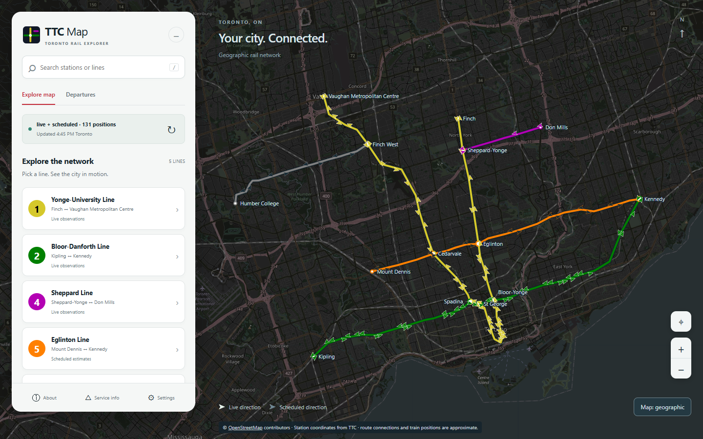

# TTC Map

A Toronto rail explorer and ESP32 LED display built around one transit-state API.
The web map shows Lines 1, 2, 4, 5 and 6 over OpenStreetMap, with route search,
station details, directional markers and a schematic view.

The project implements GTFS import and validation, bounded NTAS polling, estimated
train positions, a shared web/LED state model, the browser interface and firmware
for an eight-LED board revision. Contributor history is available in Git; individual
ownership and asset permissions are documented in [docs/ASSETS.md](docs/ASSETS.md).



The image records a real-data session on September 12, 2026; it is not a live feed.

```text
Toronto Open Data GTFS -> validated SQLite schedules/topology --+
TTC NTAS countdowns -> per-line snapshots and interpolation ----+-> map state
                                                               |-> web explorer
                                                               +-> ESP32 LED frame
```

Python/FastAPI serves the vanilla JavaScript/SVG frontend. SQLite, pandas and
HTTPX handle data; ESP-IDF/PlatformIO builds the firmware. There is no frontend
build step and no Node server.

## What the map means

- Filled arrows are NTAS-backed estimates; outlined arrows are scheduled estimates.
  Neither is GPS. Routes connect station coordinates approximately, not surveyed tracks.
- Lines 1/2/4 use NTAS when healthy. Line 5 is scheduled unless explicitly enabled
  after [coverage validation](docs/LINE_5_6.md); Line 6 is schedule-only.
- Direction follows API travel order. Unknown direction uses a neutral marker.
- Departures are scheduled, within a two-minute line-wide window capped at 200 rows.
  Service alerts, live station arrival boards and journey planning are unavailable.
- Data health does not imply normal TTC operations. Failed state requests clear
  train markers; a missing street background leaves the transit overlay usable.

## Run on Windows

Install [uv](https://docs.astral.sh/uv/getting-started/installation/), clone this
repository, then double-click `start.bat` or run it from PowerShell:

```powershell
.\start.bat
```

The launcher installs the locked dependencies and starts the server. It keeps
Python packages in `%LOCALAPPDATA%\TTC-Map\venv`, outside OneDrive. Python 3.13 is
selected by `.python-version`; uv can download it if needed. Do not repair or
reuse an old OneDrive-managed `.venv` to run this launcher.

Open <http://localhost:8000> for the map, `/search/` for timetable search, and
`/docs` or `/redoc` for the local interactive API reference. Stop with Ctrl+C.
For another port: `.\start.bat serve --port 8001`.

[Windows setup and clean-checkout verification](docs/SETUP.md) includes manual
commands, separate-checkout environments and offline rehearsal.

## macOS / Linux

```sh
uv sync --locked
uv run --no-sync ttcmap serve
```

Python 3.12+ is supported by the package; the repository pins 3.13 for development.
Use one worker and a local SQLite database. The current validation machine is
Windows; Linux/macOS launch and physical hardware validation are separate checks.

## Prepare the demo

The first refresh downloads the GTFS archive and builds the database. Network
access and several minutes may be needed; the server displays an unavailable
state until publication completes. A fresh offline checkout has no transit data.

Before presenting, run a refresh while online and check `/api/v1/health`. A valid
published schedule can support estimates when NTAS fails. For a deliberate
schedule-only demo, set `MAP_SOURCE=schedule`. Expired/missing schedules cannot
provide that fallback. Street tiles still need internet; the schematic does not.
See the [offline rehearsal](docs/SETUP.md#offline-rehearsal).

## Commands

Run these after the platform-specific setup. On Windows, set
`$env:UV_PROJECT_ENVIRONMENT = "$env:LOCALAPPDATA\TTC-Map\venv"` first, or use
`.\start.bat refresh` for a feed check.

| Command | Purpose |
|---|---|
| `uv run --no-sync ttcmap refresh` | Check/rebuild the feed; add `--force` for a forced rebuild |
| `uv run --no-sync ttcmap build-network` | Regenerate exports from the verified cache |
| `uv run --no-sync pytest` | Backend tests |
| `uv run --no-sync ruff check src tests` | Python lint |
| `node --test tests/web/*.test.mjs` | Frontend unit tests, optional Node.js |
| `node scripts/build-schematic.mjs` | Regenerate schematic after network export |

Browser tests use a pinned optional Playwright install; see [SETUP.md](docs/SETUP.md).
There is no separate JavaScript build, type-checker or linter configured.

## API and structure

The local API reference reads `/openapi.json` and can send GET requests without
external scripts. All transit routes are below `/api/v1`:

| GET endpoint | Data |
|---|---|
| `/health`, `/gtfs/status` | Dataset and per-line source diagnostics |
| `/map-config` | Matching generation, network and schematic |
| `/network`, `/layout/{name}` | Topology or an individual layout |
| `/map-state` | Estimated positions; source and optional time selection |
| `/departures?route=1` | Scheduled departure window |
| `/led-state`, `/led-state.bin` | Board frame as JSON or packed bits |

Refresh is CLI-only. The former `POST /api/v1/gtfs/refresh` is removed so a viewer
cannot trigger an expensive rebuild. The web refresh button reloads read endpoints.

| Directory | Purpose |
|---|---|
| `src/ttcmap/` | API, GTFS pipeline, source selection and LED renderer |
| `web/` | Explorer, timetable and local API reference |
| `shared/` | Reviewed station identities and generated network/layout exports |
| `firmware/` | ESP-IDF firmware; local Wi-Fi settings are gitignored |
| `hardware/` | Integrated KiCad design and eight-LED board map |
| `tests/`, `scripts/` | Validation and schematic generation |
| `data/` | Ignored feeds, database, local validation and private asset archive |

Run from an editable repository checkout. A standalone wheel does not include the
web/shared/hardware resources and is not a supported deployment package.

## Configuration and troubleshooting

Copy `.env.example` to `.env` for optional overrides; all fields are in
`src/ttcmap/config.py`. Local paths resolve against the checkout. For OneDrive
installations that also need database isolation, configure `DATA_DIR` and `DB_PATH`
to local storage. Cloud synchronization is not multi-host database coordination.

- **Port occupied:** use another port with the launcher/CLI.
- **Transit data unavailable:** check `/api/v1/health` and refresh logs. First import,
  expired schedules or a failed upgrade can cause 503 responses.
- **Scheduled labels:** live observations may be unavailable or disabled for that line.
- **Street map unavailable:** use the schematic; OSM tiles are an external service.
- **Firmware connection:** follow [ESP32_SMOKE_TEST.md](docs/ESP32_SMOKE_TEST.md).
  The eight-LED revision does not represent a fully wired station network.

See [ARCHITECTURE.md](docs/ARCHITECTURE.md), [UI_API_AUDIT.md](docs/UI_API_AUDIT.md),
[validation results](docs/UI_VALIDATION.md) and [asset/publication status](docs/ASSETS.md).
